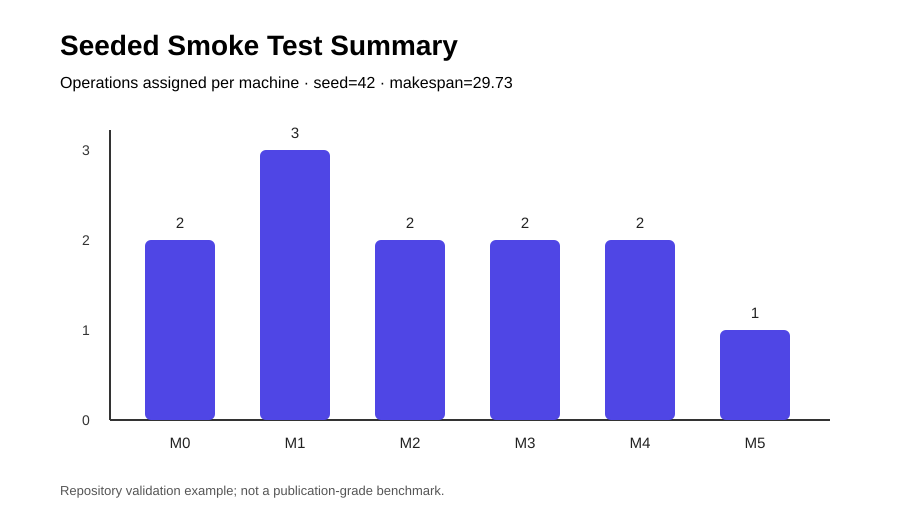

# FJSP ML Rescheduler

[](https://github.com/jorsacademy/fjsp-ml-rescheduling/actions/workflows/tests.yml)
[](https://www.python.org/)
[](LICENSE)

A research-inspired Python prototype for **Flexible Job-Shop Scheduling and dynamic rescheduling** in Industry 4.0 environments. The project combines a Genetic Algorithm scheduler with a Random Forest classifier that decides when rescheduling may be worthwhile under processing-time variation.

> This repository is an educational and experimental implementation inspired by Li et al. (2019), *Integration of Machine Learning and Optimization Techniques for Flexible Job-Shop Rescheduling in Industry 4.0*. It is not a line-by-line reproduction of the paper.

## Overview

The implementation models jobs as precedence-constrained operation sequences. Each operation may be processed by multiple compatible machines, machines may require sequence-dependent configuration changes, and setup activities compete for a limited setup-worker resource.

The workflow is conceptually:

```text
FJSP instance
    |
    v
Genetic Algorithm scheduler
    |
    v
Baseline schedule
    |
    +--> Processing-time variation features
    |
    v
Random Forest rescheduling classifier
    |
    +--> Reschedule with GA when triggered
    |
    v
Compare against periodic policies (P-2 / P-4 / P-7)
```

## Features

- Flexible Job-Shop Scheduling Problem (FJSP) representation
- Precedence-constrained job operations
- Alternative compatible machines per operation
- Sequence-dependent machine setup times
- Limited setup-worker resources
- Job-based Genetic Algorithm chromosome encoding
- Tournament selection, two-point crossover and swap mutation
- Greedy machine assignment during chromosome decoding
- Random Forest rescheduling classifier
- Processing-time variation scenarios
- AUC-based classifier evaluation
- ML-triggered vs. periodic rescheduling comparison
- Deterministic smoke tests for repository validation
- GitHub Actions CI across Python 3.10, 3.11 and 3.12

## Repository structure

```text
.
├── .github/
│   └── workflows/
│       └── tests.yml
├── docs/
│   ├── example_output.txt
│   └── example_schedule.svg
├── tests/
│   └── test_smoke.py
├── .gitignore
├── LICENSE
├── README.md
├── fjsp_ml_rescheduler.py
└── requirements.txt
```

## Installation

Python 3.10 or newer is recommended.

```bash
git clone https://github.com/jorsacademy/fjsp-ml-rescheduling.git
cd fjsp-ml-rescheduling

python -m venv .venv
source .venv/bin/activate
# Windows: .venv\Scripts\activate

python -m pip install --upgrade pip
pip install -r requirements.txt
```

## Run the experiment

```bash
python fjsp_ml_rescheduler.py
```

The default entry point:

1. creates a sample FJSP instance;
2. trains the Random Forest classifier;
3. runs ML-triggered rescheduling;
4. compares it with periodic P-2, P-4 and P-7 policies; and
5. reports rescheduling frequency and makespan improvement statistics.

The full default experiment is intentionally more computationally expensive than the CI smoke tests.

## Validation and tests

Run the local smoke-test suite with:

```bash
python -m unittest discover -s tests -v
```

You can also check Python syntax directly:

```bash
python -m py_compile fjsp_ml_rescheduler.py
```

GitHub Actions runs both checks automatically for pushes and pull requests targeting `main`, using Python 3.10, 3.11 and 3.12.

## Reproducible smoke-run example

A lightweight seeded run was executed with:

```text
random.seed(42)
np.random.seed(42)
population_size = 30
generations = 10
```

Observed result:

```text
Makespan: 29.73
Scheduled operations: 12 / 12

Operations assigned per machine:
Machine 0: 2
Machine 1: 3
Machine 2: 2
Machine 3: 2
Machine 4: 2
Machine 5: 1
```

The complete example output is available in [`docs/example_output.txt`](docs/example_output.txt).



This figure is a repository-validation example, not a publication-grade benchmark.

## Implementation notes and fixes

Compared with the initial draft, the current version:

- avoids mutating setup-worker availability while candidate machines are merely being evaluated;
- supports `num_workers > 1` using independent setup-worker availability clocks;
- validates compatible machines, required machine configurations and chromosome job IDs;
- prevents two-point crossover failures for very short chromosomes;
- guards against division by zero in rescheduling-benefit evaluation;
- detects one-class training datasets before Random Forest/AUC evaluation; and
- removes the inaccurate claim that Tabu Search is implemented.

## Research limitations

The current implementation should be treated as a **research prototype**, not as a faithful experimental reproduction of the source paper.

Most importantly, processing-time variation is included in the classifier feature vector, but the current training label is still derived by comparing GA-generated schedules on the same base instance. A stronger dynamic-rescheduling formulation should propagate disruptions into the optimization state itself, freeze completed/in-progress operations, update remaining processing times and reschedule only the unfinished portion of the system.

For publication-level experimentation, consider adding:

- established FJSP benchmark instances;
- explicit event-driven schedule-state propagation;
- machine breakdown and new-job-arrival disruptions;
- rolling-horizon or partial rescheduling;
- repeated seeded runs and confidence intervals;
- stronger optimization baselines;
- hyperparameter tuning;
- feature-importance and calibration analysis; and
- statistical significance testing between rescheduling policies.

## Core dependencies

- [NumPy](https://numpy.org/)
- [scikit-learn](https://scikit-learn.org/)

## Reference

Conceptually inspired by research on integrating machine learning and optimization for flexible job-shop rescheduling in Industry 4.0, including Li et al. (2019).

If this repository is used for academic work, consult and cite the original research source rather than treating this implementation as the authoritative formulation.

## License

Released under the [MIT License](LICENSE).
